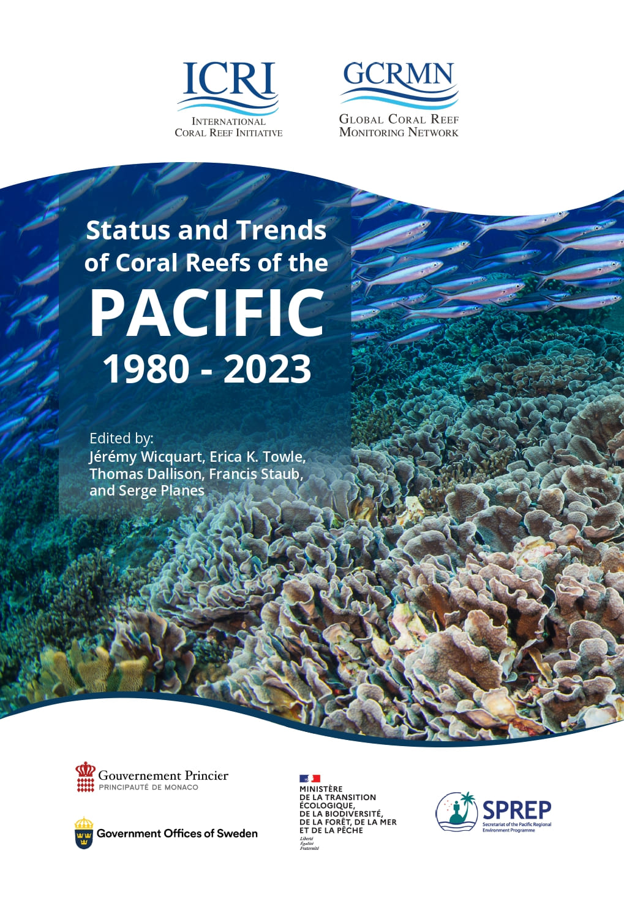

<!-- README.md is generated from README.Rmd. Please edit that file -->

```{r, include = FALSE}
knitr::opts_chunk$set(
  collapse = TRUE,
  comment = "",
  out.width = "100%"
)
options(tibble.print_min = 5, tibble.print_max = 5)
```

# **Status and Trends of Coral Reefs of the Pacific** 


## 1. Introduction

https://gcrmn.net/pacific-report-2025-v1/

## 2. Code

### Functions

* `combine_model_data.R` Combine benthic cover model results.
* `combine_plot_trends.R` Combine temporal trend plots produced by the function _plot_trends.R._
* `create_chapter_doc.qmd` Countries and territories chapter template.
* `data_descriptors.R` Get number of sites, surveys, datasets, first and last year of monitoring.
* `download_predictors.R` Download predictors extracted through GEE and stored on Google Drive.
* `extract_coeff.R` Extract linear models _a_ and _b_ coefficients.
* `extract_mannkendall.R` Calculate temporal trends using Man Kendall test.
* `graphical_par.R` Graphical parameters, including colors and fonts.
* `plot_pdp.R` Plot Partial Dependence Plot (PDP).
* `plot_pred_obs.R` Plot predicted vs observed values (model evaluation).
* `plot_prediction_map.R` Plot the map of the Caribbean with predicted values.
* `plot_raw_data.R` Plot raw benthic data.
* `plot_residuals.R` Plot residuals (model evaluation).
* `plot_trends.R` Plot temporal trends.
* `plot_vimp.R` Plot Variable Importance Plot (VIMP).
* `prepare_benthic_data.R` Prepare benthic cover data.
* `render_qmd.R` Render script _create_chapter_doc.qmd._
* `theme_graph.R` Main ggplot theme for the plots of the reports.
* `theme_map.R` Main ggplot theme for the maps of the reports.

### Cleaning and selection (`a_`)

* `a01_select_benthic-data.R` Select [gcrmndb_benthos](https://github.com/GCRMN/gcrmndb_benthos) data to use in the analyses.
* `a02_benthic_data_sources.R` Extract data sources from [gcrmndb_benthos](https://github.com/GCRMN/gcrmndb_benthos).
* `a03_clean_eez.R` Select and clean economic exclusive zones (EEZ) from [marineregions](https://marineregions.org/downloads.php).
* `a04_clean_land.R` Clean Pacific land data (high spatial resolution) from [Princeton University](https://maps.princeton.edu/).
* `a05_clean_bathy.R` Clean bathymetry data from [Natural Earth Data](https://www.naturalearthdata.com/downloads/10m-physical-vectors/).
* `a06_clean-reef-distribution.R` Select Pacific coral reefs distribution from the [Tropical Coral Reefs of the World](https://datasets.wri.org/dataset/tropical-coral-reefs-of-the-world-500-m-resolution-grid) World Resources Institute (WRI).
* `a07_reef-buffer.js` Create 100 km reef buffer using Google Earth Engine (GEE). 
* `a08_clean_cyclones.R` Clean cyclone dataset from [IBTrACS](https://www.ncei.noaa.gov/products/international-best-track-archive).
* `a09_download_crw-year.R` Extract netCDF file aggregated per year from [Coral Reef Watch (CRW)](https://coralreefwatch.noaa.gov/product/5km/index_5km_dhw.php) data.

### Extract indicators (except benthic cover) (`b_`)

* `b01_extract_indicator_land.js` Extract total land area for each EEZ using GEE.
* `b02_extract_indicator_elevation.js` Extract mean land elevation for each EEZ using GEE.
* `b03_extract_indicator_population.js` Extract human population for each EEZ using GEE. 
* `b04_extract_indicator_sst.R` Extract SST on coral reefs for each EEZ.
* `b05_extract_indicator_cyclones.R` Extract cyclones on coral reefs for each EEZ.

### Models (benthic cover) (`c_`)

* `c01_explo_benthic-data_files` Exploratory analyses of benthic cover data.  
* `c02_select_pred-sites.js` Generate sites on which the predictions will be made.       
* `c03_extract_predictor_gee.js` Extract the values of the predictors for data sources available on GEE.
* `c04_extract_predictor_gravity.R` Extract gravity as a predictor. 
* `c05_extract_predictor_enso.R` Extract ENSO as a predictor.   
* `c06_extract_predictor_cyclones.R` Extract cyclones as a predictor.
* `c07_extract_predictor_crw.R` Extract CRW derived predictors.
* `c08_model_data-preparation.R` Combine predictors and prepare observed data.      
* `c09_model_tuning_xgb.R` Machine Learning model hyperparameters tuning.
* `c10_model_bootstrap_xgb.R` Machine Learning model bootstrap.

### Figures and tables (`d_`)

* `d01_materials-and-methods.R` Produce figures for the Materials and Methods.
* `d02_pacific_map.R` Produce map of the region.         
* `d03_territories_map.R` Produce contextual maps for countries and territories.
* `d04_pacific_sst.R` Produce figures for SST for the region.
* `d05_territories_sst.R` Produce figures for SST for countries and territories.           
* `d06_pacific_cyclones.R` Produce figures for cyclones for the region.
* `d07_territories_cyclones.R` Produce figures for cyclones for countries and territories.
* `d08_pacific_spatio-temporal.R` Produce figures for spatio-temporal distribution of monitoring for the region.      
* `d09_territories_spatio-temporal.R` Produce figures for spatio-temporal distribution of monitoring for countries and territories.
* `d10_benthic-cover_trends.R` Produce figures for benthic cover temporal trends. 
* `d11_other-indicators.R` Produce figures, tables, and numbers for other indicators.
* `d12_case-studies.R` Produce figures for case studies.

### Writing and sharing (`e_`)

* `e01_create-chapters.R` Generate .docx chapters for countries and territories.  
* `e02_authors-contribution.R` Export authors' contributions .xlsx file.

## 3. Reproducibility parameters

```{r echo=FALSE, message=FALSE}

# 1. Print session info ----

devtools::session_info(c("sf", "terra", "tidyverse", "tidymodels"))

```
