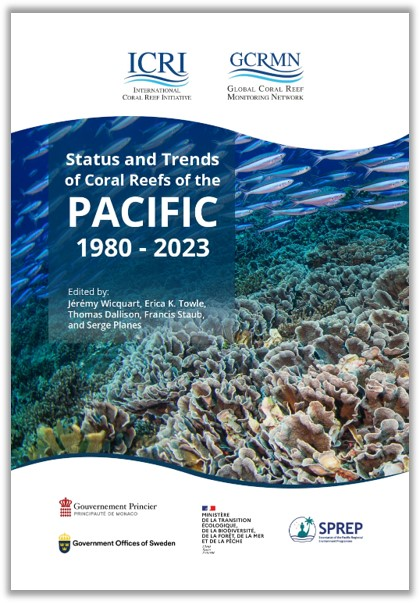

<!-- README.md is generated from README.Rmd. Please edit that file -->

# **Status and Trends of Coral Reefs of the Pacific: 1980-2023**

## 1. Introduction 

Coral reefs of the Anthropocene are increasingly threatened by a range
of human-induced stressors from anthropogenic local drivers of loss
including overfishing, pollution, and coastal development, to regional
stressors such as climate change and ocean acidification. The cumulative
impacts of these stressors have significantly altered the structure,
function, and composition of coral reef ecosystems worldwide. One of the
most documented consequences is the sustained decline in hard coral
cover exacerbated by mass bleaching events driven by anomalously high
sea surface temperatures such as those recorded in 1998, 2010, and
2014-2017, and most recently during the Fourth Global Mass Bleaching
Event. Beyond these ecological changes, coral reef degradation
undermines the ability of these ecosystems to provide vital services to
human populations including coastal protection, food security through
fisheries, and income from tourism.

Established in 1995 as an operational network of the International Coral
Reef Initiative (ICRI), the Global Coral Reef Monitoring Network (GCRMN)
plays a central role in global coral reef monitoring efforts. Working
through ten regional nodes - including the Pacific - the GCRMN produces
regular syntheses of the status and trends of coral reefs based on
harmonized scientific data. The network’s mission is to improve
understanding of reef health, support evidence-based policy and
management, and build the technical and human capacity for reef
monitoring at local, national, and regional levels. The GCRMN’s global
and regional reports are designed for policymakers, managers,
researchers, and international organizations to guide conservation
strategies and help countries meet their national and international
biodiversity commitments. In combining science, capacity building, and
policy relevance, the GCRMN is a cornerstone of efforts to safeguard
coral reefs in an era of accelerating environmental change. Since its
establishment, the GCRMN has published six global reports. Alongside
these global assessments, the GCRMN has produced numerous regional and
thematic reports focusing on the status and trends of coral reefs in
specific areas, such as the Caribbean, the Western Indian Ocean, the
Pacific, and the East Asian Seas.

This GitHub repository accompanies the [***Status and Trends of Coral
Reefs of the Pacific:
1980-2023***](https://gcrmn.net/pacific-report-2025-v1/) GCRMN report,
which provides a comprehensive overview of the condition and evolution
of shallow-water coral reefs across the Pacific region. The report
addresses key questions about changes in benthic cover (hard coral,
macroalgae, turf algae, and coralline algae) and evolving threats to
reef ecosystems over the last four decades. It includes analyses of
major coral families (Acroporidae, Pocilloporidae, Poritidae), as well
as environmental stressors such as human population pressure, thermal
stress (SST trends and anomalies), and cyclone activity. Structured in
two main parts — a regional synthesis and individual country and
territory chapters — it combines biophysical monitoring data with local
insights, including case studies and socioeconomic perspectives where
available. This GitHub repository provides the code used to produce the
results of the report.

## 2. Code

### Functions

- `combine_model_data.R` Combine benthic cover model results.
- `combine_plot_trends.R` Combine temporal trend plots produced by the
  function *plot_trends.R.*
- `create_chapter_doc.qmd` Countries and territories chapter template.
- `data_descriptors.R` Get number of sites, surveys, datasets, first and
  last year of monitoring.
- `download_predictors.R` Download predictors extracted through GEE and
  stored on Google Drive.
- `extract_coeff.R` Extract linear models *a* and *b* coefficients.
- `extract_mannkendall.R` Calculate temporal trends using Man Kendall
  test.
- `graphical_par.R` Graphical parameters, including colors and fonts.
- `plot_pdp.R` Plot Partial Dependence Plot (PDP).
- `plot_pred_obs.R` Plot predicted vs observed values (model
  evaluation).
- `plot_prediction_map.R` Plot the map of the Caribbean with predicted
  values.
- `plot_raw_data.R` Plot raw benthic data.
- `plot_residuals.R` Plot residuals (model evaluation).
- `plot_trends.R` Plot temporal trends.
- `plot_vimp.R` Plot Variable Importance Plot (VIMP).
- `prepare_benthic_data.R` Prepare benthic cover data.
- `render_qmd.R` Render script *create_chapter_doc.qmd.*
- `theme_graph.R` Main ggplot theme for the plots of the reports.
- `theme_map.R` Main ggplot theme for the maps of the reports.

### Cleaning and selection (`a_`)

- `a01_select_benthic-data.R` Select
  [gcrmndb_benthos](https://github.com/GCRMN/gcrmndb_benthos) data to
  use in the analyses.
- `a02_benthic_data_sources.R` Extract data sources from
  [gcrmndb_benthos](https://github.com/GCRMN/gcrmndb_benthos).
- `a03_clean_eez.R` Select and clean economic exclusive zones (EEZ) from
  [marineregions](https://marineregions.org/downloads.php).
- `a04_clean_land.R` Clean Pacific land data (high spatial resolution)
  from [Princeton University](https://maps.princeton.edu/).
- `a05_clean_bathy.R` Clean bathymetry data from [Natural Earth
  Data](https://www.naturalearthdata.com/downloads/10m-physical-vectors/).
- `a06_clean-reef-distribution.R` Select Pacific coral reefs
  distribution from the [Tropical Coral Reefs of the
  World](https://datasets.wri.org/dataset/tropical-coral-reefs-of-the-world-500-m-resolution-grid)
  World Resources Institute (WRI).
- `a07_reef-buffer.js` Create 100 km reef buffer using Google Earth
  Engine (GEE).
- `a08_clean_cyclones.R` Clean cyclone dataset from
  [IBTrACS](https://www.ncei.noaa.gov/products/international-best-track-archive).
- `a09_download_crw-year.R` Extract netCDF file aggregated per year from
  [Coral Reef Watch
  (CRW)](https://coralreefwatch.noaa.gov/product/5km/index_5km_dhw.php)
  data.

### Extract indicators (except benthic cover) (`b_`)

- `b01_extract_indicator_land.js` Extract total land area for each EEZ
  using GEE.
- `b02_extract_indicator_elevation.js` Extract mean land elevation for
  each EEZ using GEE.
- `b03_extract_indicator_population.js` Extract human population for
  each EEZ using GEE.
- `b04_extract_indicator_sst.R` Extract SST on coral reefs for each EEZ.
- `b05_extract_indicator_cyclones.R` Extract cyclones on coral reefs for
  each EEZ.

### Models (benthic cover) (`c_`)

- `c01_explo_benthic-data_files` Exploratory analyses of benthic cover
  data.  
- `c02_select_pred-sites.js` Generate sites on which the predictions
  will be made.  
- `c03_extract_predictor_gee.js` Extract the values of the predictors
  for data sources available on GEE.
- `c04_extract_predictor_gravity.R` Extract gravity as a predictor.
- `c05_extract_predictor_enso.R` Extract ENSO as a predictor.  
- `c06_extract_predictor_cyclones.R` Extract cyclones as a predictor.
- `c07_extract_predictor_crw.R` Extract CRW derived predictors.
- `c08_model_data-preparation.R` Combine predictors and prepare observed
  data.  
- `c09_model_tuning_xgb.R` Machine Learning model hyperparameters
  tuning.
- `c10_model_bootstrap_xgb.R` Machine Learning model bootstrap.

### Figures and tables (`d_`)

- `d01_materials-and-methods.R` Produce figures for the Materials and
  Methods.
- `d02_pacific_map.R` Produce map of the region.  
- `d03_territories_map.R` Produce contextual maps for countries and
  territories.
- `d04_pacific_sst.R` Produce figures for SST for the region.
- `d05_territories_sst.R` Produce figures for SST for countries and
  territories.  
- `d06_pacific_cyclones.R` Produce figures for cyclones for the region.
- `d07_territories_cyclones.R` Produce figures for cyclones for
  countries and territories.
- `d08_pacific_spatio-temporal.R` Produce figures for spatio-temporal
  distribution of monitoring for the region.  
- `d09_territories_spatio-temporal.R` Produce figures for
  spatio-temporal distribution of monitoring for countries and
  territories.
- `d10_benthic-cover_trends.R` Produce figures for benthic cover
  temporal trends.
- `d11_other-indicators.R` Produce figures, tables, and numbers for
  other indicators.
- `d12_case-studies.R` Produce figures for case studies.

### Writing and sharing (`e_`)

- `e01_create-chapters.R` Generate .docx chapters for countries and
  territories.  
- `e02_authors-contribution.R` Export authors’ contributions .xlsx file.

## 3. Reproducibility parameters

    Warning in system2("quarto", "-V", stdout = TRUE, env = paste0("TMPDIR=", :
    l'exécution de la commande '"quarto"
    TMPDIR=C:/Users/jwicquart/AppData/Local/Temp/RtmpeUI35m/file390823d22d73 -V'
    renvoie un statut 1
    ─ Session info ───────────────────────────────────────────────────────────────
     setting  value
     version  R version 4.5.0 (2025-04-11 ucrt)
     os       Windows 11 x64 (build 22631)
     system   x86_64, mingw32
     ui       RTerm
     language (EN)
     collate  French_France.utf8
     ctype    French_France.utf8
     tz       Europe/Paris
     date     2025-05-26
     pandoc   3.4 @ C:/Program Files/RStudio/resources/app/bin/quarto/bin/tools/ (via rmarkdown)
     quarto   NA @ C:\\PROGRA~1\\RStudio\\RESOUR~1\\app\\bin\\quarto\\bin\\quarto.exe

    ─ Packages ───────────────────────────────────────────────────────────────────
     package       * version    date (UTC) lib source
     askpass         1.2.1      2024-10-04 [1] CRAN (R 4.5.0)
     backports       1.5.0      2024-05-23 [1] CRAN (R 4.5.0)
     base64enc       0.1-3      2015-07-28 [1] CRAN (R 4.5.0)
     bit             4.6.0      2025-03-06 [1] CRAN (R 4.5.0)
     bit64           4.6.0-1    2025-01-16 [1] CRAN (R 4.5.0)
     blob            1.2.4      2023-03-17 [1] CRAN (R 4.5.0)
     broom           1.0.8      2025-03-28 [1] CRAN (R 4.5.0)
     bslib           0.9.0      2025-01-30 [1] CRAN (R 4.5.0)
     cachem          1.1.0      2024-05-16 [1] CRAN (R 4.5.0)
     callr           3.7.6      2024-03-25 [1] CRAN (R 4.5.0)
     cellranger      1.1.0      2016-07-27 [1] CRAN (R 4.5.0)
     class           7.3-23     2025-01-01 [1] CRAN (R 4.5.0)
     classInt        0.4-11     2025-01-08 [1] CRAN (R 4.5.0)
     cli             3.6.5      2025-04-23 [1] CRAN (R 4.5.0)
     clipr           0.8.0      2022-02-22 [1] CRAN (R 4.5.0)
     clock           0.7.3      2025-03-21 [1] CRAN (R 4.5.0)
     codetools       0.2-20     2024-03-31 [1] CRAN (R 4.5.0)
     conflicted      1.2.0      2023-02-01 [1] CRAN (R 4.5.0)
     cpp11           0.5.2      2025-03-03 [1] CRAN (R 4.5.0)
     crayon          1.5.3      2024-06-20 [1] CRAN (R 4.5.0)
     curl            6.2.2      2025-03-24 [1] CRAN (R 4.5.0)
     data.table      1.17.0     2025-02-22 [1] CRAN (R 4.5.0)
     DBI             1.2.3      2024-06-02 [1] CRAN (R 4.5.0)
     dbplyr          2.5.0      2024-03-19 [1] CRAN (R 4.5.0)
     diagram         1.6.5      2020-09-30 [1] CRAN (R 4.5.0)
     dials           1.4.0      2025-02-13 [1] CRAN (R 4.5.0)
     DiceDesign      1.10       2023-12-07 [1] CRAN (R 4.5.0)
     digest          0.6.37     2024-08-19 [1] CRAN (R 4.5.0)
     doFuture        1.0.2      2025-03-16 [1] CRAN (R 4.5.0)
     dplyr           1.1.4      2023-11-17 [1] CRAN (R 4.5.0)
     dtplyr          1.3.1      2023-03-22 [1] CRAN (R 4.5.0)
     e1071           1.7-16     2024-09-16 [1] CRAN (R 4.5.0)
     evaluate        1.0.3      2025-01-10 [1] CRAN (R 4.5.0)
     fansi           1.0.6      2023-12-08 [1] CRAN (R 4.5.0)
     farver          2.1.2      2024-05-13 [1] CRAN (R 4.5.0)
     fastmap         1.2.0      2024-05-15 [1] CRAN (R 4.5.0)
     fontawesome     0.5.3      2024-11-16 [1] CRAN (R 4.5.0)
     forcats         1.0.0      2023-01-29 [1] CRAN (R 4.5.0)
     foreach         1.5.2      2022-02-02 [1] CRAN (R 4.5.0)
     fs              1.6.6      2025-04-12 [1] CRAN (R 4.5.0)
     furrr           0.3.1      2022-08-15 [1] CRAN (R 4.5.0)
     future          1.49.0     2025-05-09 [1] CRAN (R 4.5.0)
     future.apply    1.11.3     2024-10-27 [1] CRAN (R 4.5.0)
     gargle          1.5.2      2023-07-20 [1] CRAN (R 4.5.0)
     generics        0.1.4      2025-05-09 [1] CRAN (R 4.5.0)
     ggplot2         3.5.2      2025-04-09 [1] CRAN (R 4.5.0)
     globals         0.18.0     2025-05-08 [1] CRAN (R 4.5.0)
     glue            1.8.0      2024-09-30 [1] CRAN (R 4.5.0)
     googledrive     2.1.1      2023-06-11 [1] CRAN (R 4.5.0)
     googlesheets4   1.1.1      2023-06-11 [1] CRAN (R 4.5.0)
     gower           1.0.2      2024-12-17 [1] CRAN (R 4.5.0)
     GPfit           1.0-9      2025-04-12 [1] CRAN (R 4.5.0)
     gtable          0.3.6      2024-10-25 [1] CRAN (R 4.5.0)
     hardhat         1.4.1      2025-01-31 [1] CRAN (R 4.5.0)
     haven           2.5.4      2023-11-30 [1] CRAN (R 4.5.0)
     highr           0.11       2024-05-26 [1] CRAN (R 4.5.0)
     hms             1.1.3      2023-03-21 [1] CRAN (R 4.5.0)
     htmltools       0.5.8.1    2024-04-04 [1] CRAN (R 4.5.0)
     httr            1.4.7      2023-08-15 [1] CRAN (R 4.5.0)
     ids             1.0.1      2017-05-31 [1] CRAN (R 4.5.0)
     infer           1.0.8      2025-04-14 [1] CRAN (R 4.5.0)
     ipred           0.9-15     2024-07-18 [1] CRAN (R 4.5.0)
     isoband         0.2.7      2022-12-20 [1] CRAN (R 4.5.0)
     iterators       1.0.14     2022-02-05 [1] CRAN (R 4.5.0)
     jquerylib       0.1.4      2021-04-26 [1] CRAN (R 4.5.0)
     jsonlite        2.0.0      2025-03-27 [1] CRAN (R 4.5.0)
     KernSmooth      2.23-26    2025-01-01 [1] CRAN (R 4.5.0)
     knitr           1.50       2025-03-16 [1] CRAN (R 4.5.0)
     labeling        0.4.3      2023-08-29 [1] CRAN (R 4.5.0)
     lattice         0.22-7     2025-04-02 [1] CRAN (R 4.5.0)
     lava            1.8.1      2025-01-12 [1] CRAN (R 4.5.0)
     lhs             1.2.0      2024-06-30 [1] CRAN (R 4.5.0)
     lifecycle       1.0.4      2023-11-07 [1] CRAN (R 4.5.0)
     listenv         0.9.1      2024-01-29 [1] CRAN (R 4.5.0)
     lubridate       1.9.4      2024-12-08 [1] CRAN (R 4.5.0)
     magrittr        2.0.3      2022-03-30 [1] CRAN (R 4.5.0)
     MASS            7.3-65     2025-02-28 [1] CRAN (R 4.5.0)
     Matrix          1.7-3      2025-03-11 [1] CRAN (R 4.5.0)
     memoise         2.0.1      2021-11-26 [1] CRAN (R 4.5.0)
     mgcv            1.9-3      2025-04-04 [1] CRAN (R 4.5.0)
     mime            0.13       2025-03-17 [1] CRAN (R 4.5.0)
     modeldata       1.4.0      2024-06-19 [1] CRAN (R 4.5.0)
     modelenv        0.2.0      2024-10-14 [1] CRAN (R 4.5.0)
     modelr          0.1.11     2023-03-22 [1] CRAN (R 4.5.0)
     nlme            3.1-168    2025-03-31 [1] CRAN (R 4.5.0)
     nnet            7.3-20     2025-01-01 [1] CRAN (R 4.5.0)
     numDeriv        2016.8-1.1 2019-06-06 [1] CRAN (R 4.5.0)
     openssl         2.3.2      2025-02-03 [1] CRAN (R 4.5.0)
     parallelly      1.44.0     2025-05-07 [1] CRAN (R 4.5.0)
     parsnip         1.3.1      2025-03-12 [1] CRAN (R 4.5.0)
     patchwork       1.3.0      2024-09-16 [1] CRAN (R 4.5.0)
     pillar          1.10.2     2025-04-05 [1] CRAN (R 4.5.0)
     pkgconfig       2.0.3      2019-09-22 [1] CRAN (R 4.5.0)
     prettyunits     1.2.0      2023-09-24 [1] CRAN (R 4.5.0)
     processx        3.8.6      2025-02-21 [1] CRAN (R 4.5.0)
     prodlim         2025.04.28 2025-04-28 [1] CRAN (R 4.5.0)
     progress        1.2.3      2023-12-06 [1] CRAN (R 4.5.0)
     progressr       0.15.1     2024-11-22 [1] CRAN (R 4.5.0)
     proxy           0.4-27     2022-06-09 [1] CRAN (R 4.5.0)
     ps              1.9.1      2025-04-12 [1] CRAN (R 4.5.0)
     purrr           1.0.4      2025-02-05 [1] CRAN (R 4.5.0)
     R6              2.6.1      2025-02-15 [1] CRAN (R 4.5.0)
     ragg            1.4.0      2025-04-10 [1] CRAN (R 4.5.0)
     rappdirs        0.3.3      2021-01-31 [1] CRAN (R 4.5.0)
     RColorBrewer    1.1-3      2022-04-03 [1] CRAN (R 4.5.0)
     Rcpp            1.0.14     2025-01-12 [1] CRAN (R 4.5.0)
     readr           2.1.5      2024-01-10 [1] CRAN (R 4.5.0)
     readxl          1.4.5      2025-03-07 [1] CRAN (R 4.5.0)
     recipes         1.3.0      2025-04-17 [1] CRAN (R 4.5.0)
     rematch         2.0.0      2023-08-30 [1] CRAN (R 4.5.0)
     rematch2        2.1.2      2020-05-01 [1] CRAN (R 4.5.0)
     reprex          2.1.1      2024-07-06 [1] CRAN (R 4.5.0)
     rlang           1.1.6      2025-04-11 [1] CRAN (R 4.5.0)
     rmarkdown       2.29       2024-11-04 [1] CRAN (R 4.5.0)
     rpart           4.1.24     2025-01-07 [1] CRAN (R 4.5.0)
     rsample         1.3.0      2025-04-02 [1] CRAN (R 4.5.0)
     rstudioapi      0.17.1     2024-10-22 [1] CRAN (R 4.5.0)
     rvest           1.0.4      2024-02-12 [1] CRAN (R 4.5.0)
     s2              1.1.7      2024-07-17 [1] CRAN (R 4.5.0)
     sass            0.4.10     2025-04-11 [1] CRAN (R 4.5.0)
     scales          1.4.0      2025-04-24 [1] CRAN (R 4.5.0)
     selectr         0.4-2      2019-11-20 [1] CRAN (R 4.5.0)
     sf              1.0-20     2025-03-24 [1] CRAN (R 4.5.0)
     sfd             0.1.0      2024-01-08 [1] CRAN (R 4.5.0)
     shape           1.4.6.1    2024-02-23 [1] CRAN (R 4.5.0)
     slider          0.3.2      2024-10-25 [1] CRAN (R 4.5.0)
     sparsevctrs     0.3.3      2025-04-14 [1] CRAN (R 4.5.0)
     SQUAREM         2021.1     2021-01-13 [1] CRAN (R 4.5.0)
     stringi         1.8.7      2025-03-27 [1] CRAN (R 4.5.0)
     stringr         1.5.1      2023-11-14 [1] CRAN (R 4.5.0)
     survival        3.8-3      2024-12-17 [1] CRAN (R 4.5.0)
     sys             3.4.3      2024-10-04 [1] CRAN (R 4.5.0)
     systemfonts     1.2.3      2025-04-30 [1] CRAN (R 4.5.0)
     terra           1.8-50     2025-05-09 [1] CRAN (R 4.5.0)
     textshaping     1.0.1      2025-05-01 [1] CRAN (R 4.5.0)
     tibble          3.2.1      2023-03-20 [1] CRAN (R 4.5.0)
     tidymodels      1.3.0      2025-02-21 [1] CRAN (R 4.5.0)
     tidyr           1.3.1      2024-01-24 [1] CRAN (R 4.5.0)
     tidyselect      1.2.1      2024-03-11 [1] CRAN (R 4.5.0)
     tidyverse       2.0.0      2023-02-22 [1] CRAN (R 4.5.0)
     timechange      0.3.0      2024-01-18 [1] CRAN (R 4.5.0)
     timeDate        4041.110   2024-09-22 [1] CRAN (R 4.5.0)
     tinytex         0.57       2025-04-15 [1] CRAN (R 4.5.0)
     tune            1.3.0      2025-02-21 [1] CRAN (R 4.5.0)
     tzdb            0.5.0      2025-03-15 [1] CRAN (R 4.5.0)
     units           0.8-7      2025-03-11 [1] CRAN (R 4.5.0)
     utf8            1.2.5      2025-05-01 [1] CRAN (R 4.5.0)
     uuid            1.2-1      2024-07-29 [1] CRAN (R 4.5.0)
     vctrs           0.6.5      2023-12-01 [1] CRAN (R 4.5.0)
     viridisLite     0.4.2      2023-05-02 [1] CRAN (R 4.5.0)
     vroom           1.6.5      2023-12-05 [1] CRAN (R 4.5.0)
     warp            0.2.1      2023-11-02 [1] CRAN (R 4.5.0)
     withr           3.0.2      2024-10-28 [1] CRAN (R 4.5.0)
     wk              0.9.4      2024-10-11 [1] CRAN (R 4.5.0)
     workflows       1.2.0      2025-02-19 [1] CRAN (R 4.5.0)
     workflowsets    1.1.0      2024-03-21 [1] CRAN (R 4.5.0)
     xfun            0.52       2025-04-02 [1] CRAN (R 4.5.0)
     xml2            1.3.8      2025-03-14 [1] CRAN (R 4.5.0)
     yaml            2.3.10     2024-07-26 [1] CRAN (R 4.5.0)
     yardstick       1.3.2      2025-01-22 [1] CRAN (R 4.5.0)

     [1] C:/Users/jwicquart/AppData/Local/Programs/R/R-4.5.0/library

    ──────────────────────────────────────────────────────────────────────────────
